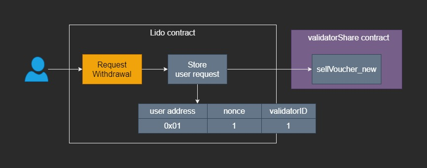
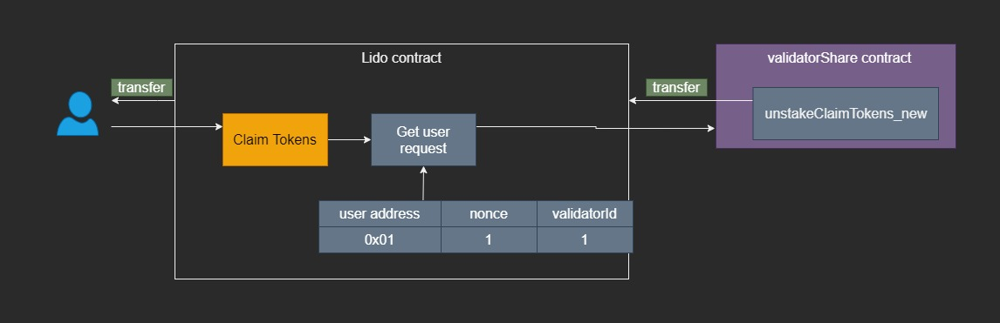

# User

a user can interact only with the poLido contract to:

-   submit ERC20 MATICs.
-   Request withdraw.
-   Claim token.
-   call ERC20 functions.

## Deposit

We calculate how many stMatic a user will get when submits Matic using the following operation:

**`sharePerUser = submittedMatics * totalShares / totalPooledMatic`**

The totalPooledMatic is the total amount of the buffered tokens(submitted by the user but not yet delegated) plus the total delegated.

**`totalPooledMatic = totalBuffered Matic + totalDelegatedMatics`**

#### Example:

**Initial states:**

```js
totalShares = 0;
totalPooledMatic = 0;
```

**Case 1:**

```js
User1:
- Submit => 1000 Matic
- Gets => 1000 StMatic
```

**update states 1:**

```js
totalShares = 1000;
totalPooledMatic = 1000;
```

**Users Shares:**
User | userP = userShares / totalShares | userMatic = userP _ totalPooledMatic
--- | --- | ---
1 | 1000 / 1000 = 1 | 1 _ 1000 = 1000

**Case 2:**

```js
User2:
- Submit => 500 Matic
```

| User | submit \* totalShares / totalPooledMatic | StMatic |
| ---- | ---------------------------------------- | ------- |
| 2    | 500 \* 1000 / 1000                       | 500     |

**update states 1:**

```js
totalShares = 1500;
totalPooledMatic = 1500;
```

**Users Shares:**
User | userP = userShares / totalShares | userMatic = userP _ totalPooledMatic
--- | --- | ---
1 | 1000 / 1500 = 0.66 | 0.66 _ 1500 = 1000
2 | 500 / 1500 = 0.33 | 0.33 \* 1500 = 500

**Case 3:**
The system was slashed

```js
slash => -100 Matic
```

**update states:**

```js
totalShares = 1500;
totalPooledMatic = 1400;
```

**Users Shares:**
User | userP = userShares / totalShares | userMatic = userP _ totalPooledMatic
--- | --- | ---
1 | 1000 / 1500 = 0.66 | 0.66 _ 1400 = 933.33
2 | 500 / 1500 = 0.33 | 0.33 \* 1400 = 466.66

**Case 4:**

```js
User3:
- Submit => 500 Matic
```

| User | submit \* totalShares / totalPooledMatic | StMatic |
| ---- | ---------------------------------------- | ------- |
| 3    | 500 \* 1500 / 1400                       | 535.71  |

**update states:**

```js
totalShares = 2035.71;
totalPooledMatic = 1900;
```

**Users Shares:**
User | userP = userShares / totalShares | userMatic = userP _ totalPooledMatic
--- | --- | ---
1 | 1000 / 2035.71 = 0.4912 | 0.4912 _ 1900 = 933.33
2 | 500 / 2035.71 = 0.2456 | 0.2456 _ 1900 = 466.66
3 | 500 / 2035.71 = 0.2456 | 0.2456 _ 1900 = 500

When the system gets slashed the total pooled Matic decrease, and it increases only when a user submits Matics again. The reason is to keep the StMatic no-rebasable.

## Withdraw

The withdrawal uses the new validatorShare API, this allows us to have a nonce that we can use to map each user request with this nonce.
The Matic contract tracks each validatorShare nonce which will increment each time a new withdrawal request happens.

The withdrawal process has two phases:
**1. Request withdrawal**

-   The user requests withdrawal.
-   Store user requests in a list and assigns to it the request nonce and validatorID.
-   call the sellVoucher_new function


**2. Claim tokens:**

-   The user calls the claim token function.
-   Check if the user exists in the request withdrawal list, if yes, call the claimUnstake function on the validators to share the contract
-   Transfer tokens to the user.


